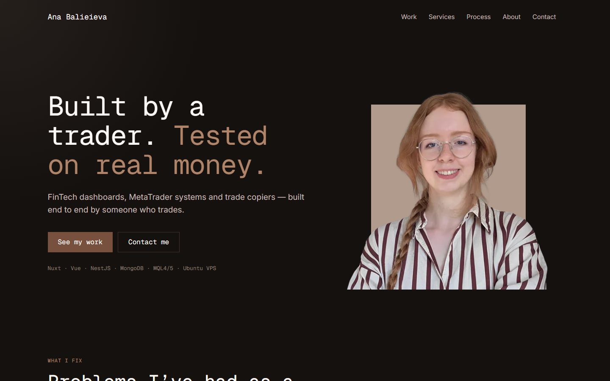
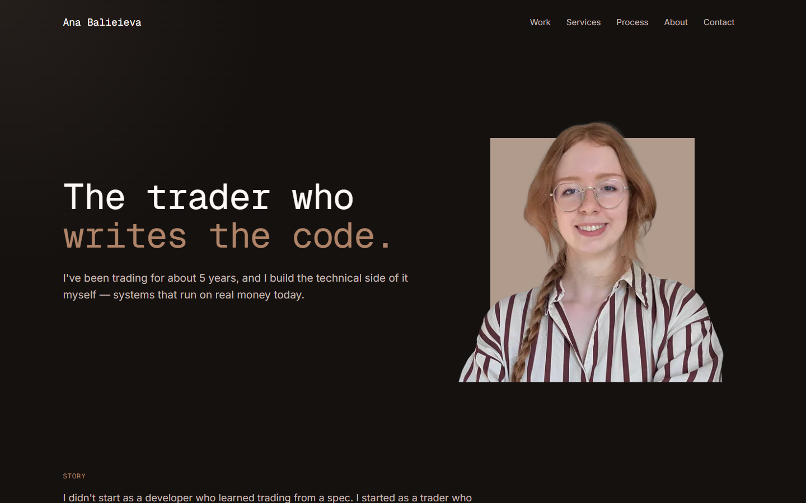
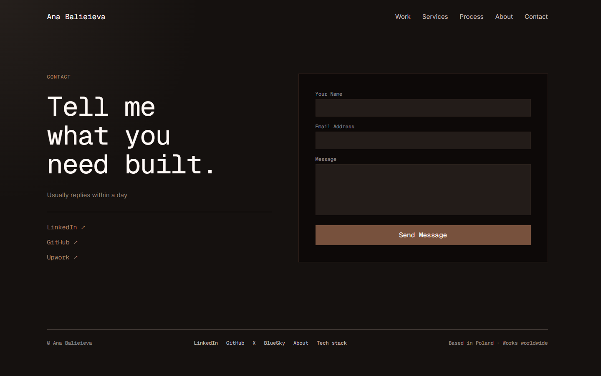

# dev.anastasiiabalv.com

Developer site of Ana Balieieva — FinTech dashboards, MetaTrader systems and trade copiers.

**Live:** [dev.anastasiiabalv.com](https://dev.anastasiiabalv.com) · main landing: [anastasiiabalv.com](https://anastasiiabalv.com)



| Mobile                                                 | About                                             | Contact                                               |
| ------------------------------------------------------ | ------------------------------------------------- | ----------------------------------------------------- |
|  |  |  |

## Stack

- [Nuxt 4](https://nuxt.com) + Vue 3, TypeScript
- Tailwind CSS 4 (`@tailwindcss/vite`), `@nuxt/image`, `@nuxt/fonts`, VueUse
- [Resend](https://resend.com) — sends the contact form messages by e-mail
- Vitest (unit + Nuxt component tests), Playwright (end-to-end hydration check)
- ESLint + Prettier, run on every commit by Husky and lint-staged
- Production: Node server run by pm2

## Quick start

Needs Node.js 24.

```bash
npm install
npm run dev   # http://localhost:3000
```

## Scripts

| Command               | What it does                                          |
| --------------------- | ----------------------------------------------------- |
| `npm run dev`         | Dev server with hot reload                            |
| `npm run build`       | Production build into `.output/`                      |
| `npm run preview`     | Run the production build locally                      |
| `npm test`            | Vitest: unit and Nuxt component tests                 |
| `npx playwright test` | End-to-end test (page loads without hydration errors) |
| `npx eslint .`        | Lint                                                  |
| `npm run clean`       | Remove Nuxt build caches                              |

## Project structure

```text
app/
  pages/          index (landing), about, stack, contact
  components/     page sections (Hero, Problems, Work, Services, Process, Proof, Toolkit, Contact, Footer…)
  layouts/        default layout: navbar, footer, contact form modal
  composables/    usePageSeo: titles, descriptions, social previews
  utils/links.ts  social and profile links (LinkedIn, GitHub, Upwork…)
  assets/css/     main.css: Tailwind setup, colour tokens, shared utilities (btn-primary, card…)
server/api/       contact.post.ts: contact form endpoint (Resend)
shared/types/     types shared by the app and the server
public/           images, favicon
test/
  unit/           server logic (contact endpoint)
  nuxt/           component tests in a Nuxt environment
  e2e/            Playwright: hydration check
docs/screenshots/ images for this README
```

## Pipelines

- **Pull requests to `main`** — GitHub Actions ([test.yaml](.github/workflows/test.yaml)): install, lint, build,
  then Playwright checks the built site for Vue hydration errors.
- **Every commit** — Husky runs lint-staged: ESLint `--fix` and Prettier on changed `.vue/.ts/.js` files.
- **Dependencies** — Renovate opens update PRs (see the Dependency Dashboard issue).
- **Reviews** — CodeRabbit reviews pull requests ([.coderabbit.yaml](.coderabbit.yaml)).

## Deploy

```bash
npm ci
npm run build
pm2 start ecosystem.config.cjs   # serves .output/server/index.mjs on port 7034, one process per CPU core
```
